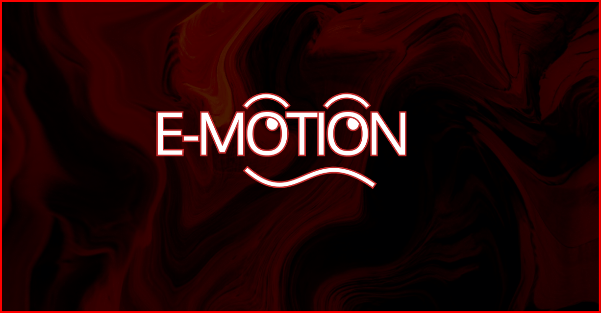

# E-MOTION

---

A Python project leveraging NLTK to identify and flag emotion of message in text. Designed for real-time moderation and community safety.

### TL;DR:
  - Python project.
  - Input text and it outputs an emotion message (Positive, Neutral, Negative).
  - NLTK, Gradio, ML.
